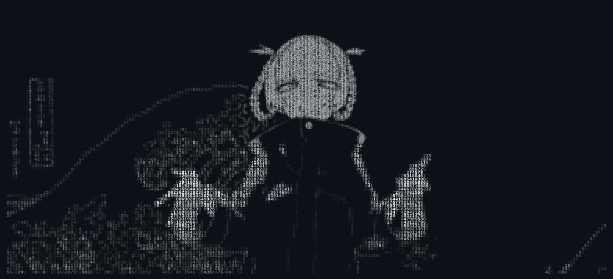

  

## Stack

  &nbsp;
  &nbsp;
  &nbsp;
  &nbsp;
  &nbsp;
  &nbsp;
  
   
  Python &middot; TypeScript &middot; JavaScript &middot; Rust
   
  React &middot; Node.js &middot; Tauri

  

  &nbsp;
  &nbsp;
  

